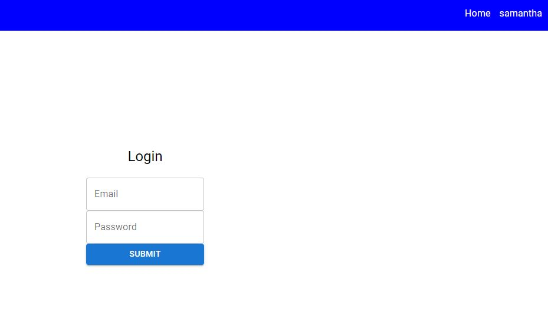
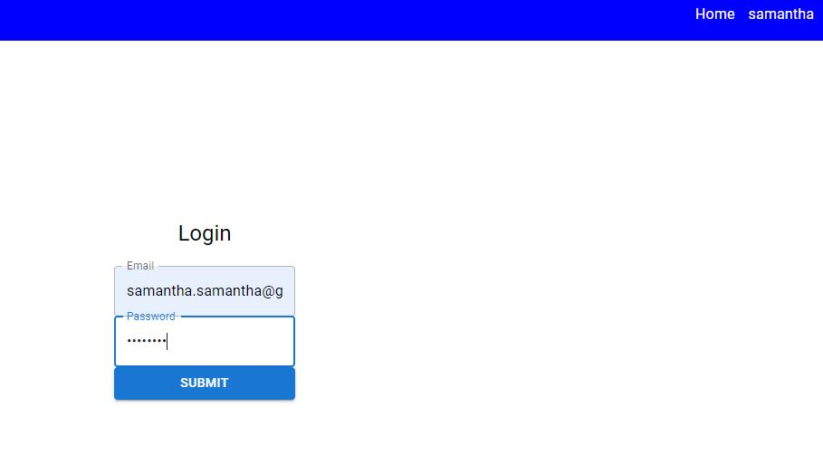
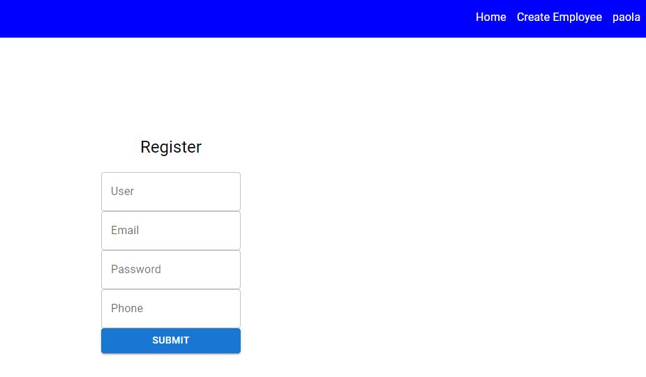
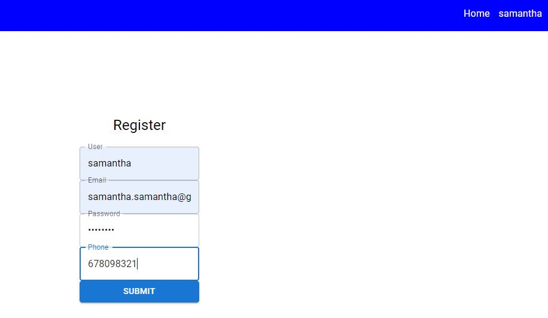
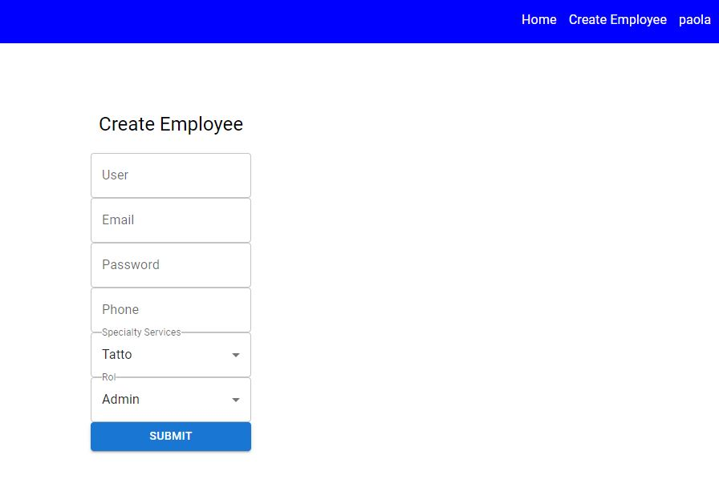

<h1 align="center">Tattoo Studio</h1>​
​
<h2 align="center">Frontend application for a tattoo studio centre</h2>

## Table of contents
- Title project
- Project description
- Wiews
- Technologies Used
- Licence and copyright

### Project descriptión
We have developed a frontend web application to simulate the management of appointments in a tattoo studio centre, in which we have mainly used the tools of React vite, redux, mui core, to generate the various different managements such as: registration, login, appointment booking, user creation in case of being super administrator, users can select the tattoo of their choice, then fill out a form to make their appointment.

### Wiews

### Technologies Used

### Grateful
First of all to my colleagues who have contributed their opinions at opportune moments to make all the information seen in the classroom more fluid, to the existence of applications such as stack overflow, tutorials on the subject.  
​
### Licence and copyright

📝 The copyright belongs to me Meriyen Rodríguez, in this web application proposed by the Geekshubs academy as the first frontend version.

