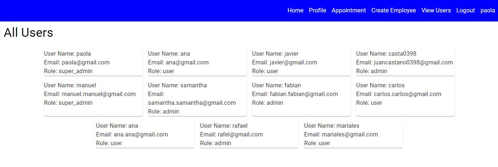
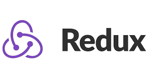
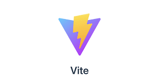

<h1 align="center">Tattoo Studio</h1>​
​
<h2 align="center">Frontend application for a tattoo studio centre</h2>

## Table of contents
- Title project
- Project description
- Wiews
- Technologies Used
- Licence and copyright

### Project descriptión
I have developed a frontend web application to simulate the management of appointments in a tattoo studio center, using the tools of React vite, redux, mui core, mysql wokbench, to generate different managements. New users must register and log in, then they will be able to see the design gallery to schedule an appointment, then confirm, view their appointments as well as view their profile. Center employees will be able to see appointment reservations as well as your profile. The administrator will be able to create employees, view appointments and users.

### Wiews

HOME

LOGIN

REGISTER

SCHEDULE APPOINTMENT

SUCCESSFULLY CREATED APPOINTMENT

PROFILE

VIEW APPOINTMENT

VIEW HEADER SUPER ADMIN

VIEW ALL APPOINTMENT SUPER ADMIN

VIEW ALL USERS SUPER ADMIN

CREATE EMPLOYEES SUPER ADMIN

### Technologies Used

### Grateful
First of all to my colleagues who have contributed their opinions at opportune moments to make all the information seen in the classroom more fluid, to the existence of applications such as stack overflow, tutorials on the subject.  
​
### Licence and copyright

📝 The copyright belongs to me Meriyen Rodríguez, in this web application proposed by the Geekshubs academy as the first frontend version.

